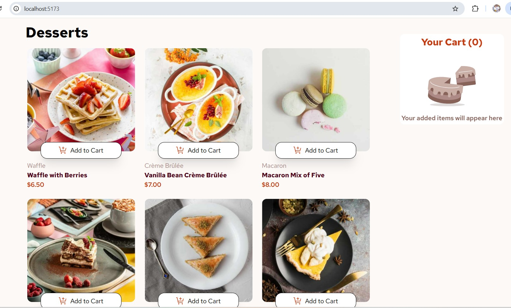
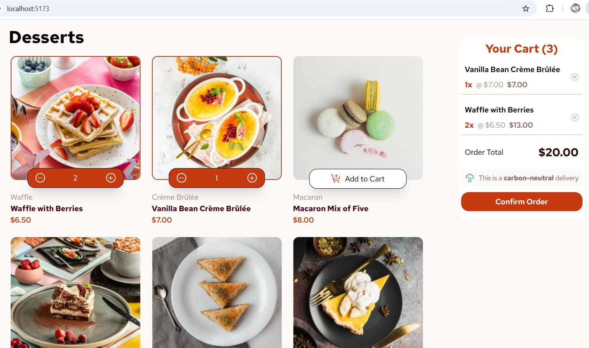
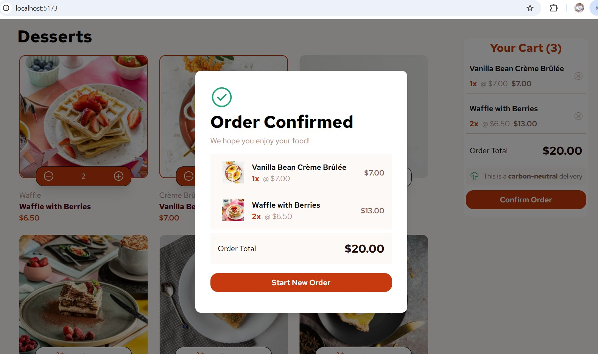

# Frontend Mentor - Product list with cart solution

This is a solution to the [Product list with cart challenge on Frontend Mentor](https://www.frontendmentor.io/challenges/product-list-with-cart-5MmqLVAp_d). Frontend Mentor challenges help you improve your coding skills by building realistic projects. 

## Table of contents

- [Overview](#overview)
  - [The challenge](#the-challenge)
  - [Screenshot](#screenshot)
  - [Links](#links)
- [My process](#my-process)
  - [Built with](#built-with)
  - [What I learned](#what-i-learned)
  - [Useful resources](#useful-resources)
  - [AI Collaboration](#ai-collaboration)
- [Author](#author)

## Overview

### The challenge

Users should be able to:

- Add items to the cart and remove them
- Increase/decrease the number of items in the cart
- See an order confirmation modal when they click "Confirm Order"
- Reset their selections when they click "Start New Order"
- View the optimal layout for the interface depending on their device's screen size
- See hover and focus states for all interactive elements on the page

### Screenshot






### Links

- Solution URL: [@github](https://github.com/DanielMarques1404/product-list-with-cart-main)
- Live Site URL: [@product-list-with-cart-main](https://product-list-with-cart-main-tau.vercel.app)

## My process

### Built with

- Semantic HTML5 markup
- CSS custom properties
- TailwindCSS
- Mobile-first workflow
- [React](https://react.dev/) - JS library
- [Vite](https://vite.dev/) - React framework


### What I learned

I've found very useful to use React Context in this project. I can easily manage the cart elements just using the hook that provides the CartContext.

```js
type CartContextType = {
  productsInCart: ProductInCart[];
  existsInCart: (productName: string) => boolean;
  clearCart: (productName?: string) => void;
  addProductToCart: (product: Product) => void;
  removeProductFromCart: (productName: string) => void;
};

export const CartContext = createContext<CartContextType | undefined>(
  undefined,
);
```

```js
import { useContext } from "react";
import { CartContext } from "../context/CartContext";

export const useCartContext = () => {
  const context = useContext(CartContext);
  if (!context) {
    throw new Error("Unavailable Cart Context");
  }
  return context;
};
```

### Useful resources

- [tailwindcss](https://tailwindcss.com/) - This helped me for keep the page's style

### AI Collaboration

I've used GitHub Copilot to put in place some small issues that I've found along the way. Mainly problems related to page style.

## Author

- Frontend Mentor - [@DanielMarques1404](https://www.frontendmentor.io/profile/DanielMarques1404)
- LinkedIn - [@dan-marques](https://www.linkedin.com/in/dan-marques/)